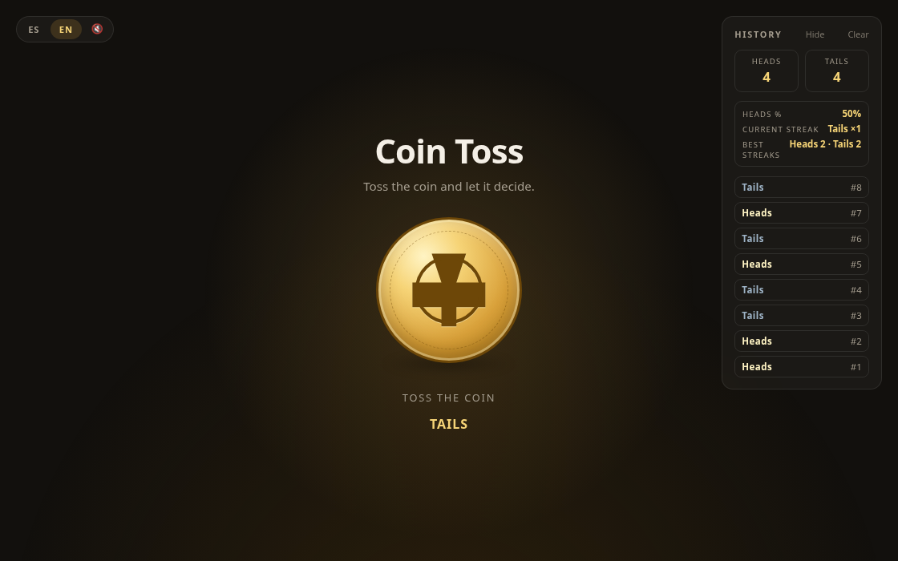

# Coin Flip

A tap-to-flip coin that settles the argument. Tap the coin, it spins, it lands,
and the history keeps score.

**Live demo: https://damrek.github.io/coin-flip/**


[](LICENSE)



## Features

- CSS-only flip animation with a drop shadow that scales with the lift
- Coin faces drawn as inline SVG (a classical medallion for heads, a cross pattée for tails)
- Running heads/tails tally
- Flip stats with heads %, current streak, and best streaks per side
- Optional WebAudio flip sounds (tick at the apex, thud on landing) with haptics, off by default and persisted in `localStorage`
- Scrollable history of the last 50 flips, persisted in `localStorage`
- Spanish / English language selector
- Respects `prefers-reduced-motion`: the result is announced without the animation
- Keyboard accessible, with `aria-pressed`, `role="status"` and `aria-live` regions

## Run it

Install dependencies, build the bundle, then serve the repo root:

```bash
npm install
npm run build
python3 -m http.server 8000
```

Then open <http://localhost:8000>.

## How it works

| File | Role |
| --- | --- |
| `index.html` | Markup, i18n hooks via `data-i18n`, inline SVG coin faces |
| `style.css` | Layout, glow background, flip animation, scrollbar styling |
| `app.js` | Legacy vanilla script, kept as reference until removal |
| `src/main.ts` | Bundle entry: queries the DOM and wires events |
| `src/game.ts` | Flip state machine and outcome logic |
| `src/ui.ts` | DOM rendering, language switching, history view |
| `src/store.ts` | `localStorage` persistence for history, language, sound |
| `src/stats.ts` | Tally, heads %, streaks |
| `src/sound.ts` | WebAudio tick/thud and haptics |
| `src/i18n.ts` | Spanish/English strings |
| `src/config.ts` | Shared constants |
| `dist/` | Built minified IIFE bundle loaded by `index.html` (gitignored, produced by `npm run build`) |

State lives in two `localStorage` keys: `coinflip.history.v1` and `coinflip.lang`.
Clearing the history empties the first one and leaves the rest untouched.

## Deploy

GitHub Pages deploys on every push to `main`: the Actions workflow installs
dependencies, runs `npm run build`, and publishes the repo root (including the
fresh `dist/` bundle) to Pages.

## Contributing

Issues and pull requests are welcome.

## License

[MIT](LICENSE) © 2026 damrek
